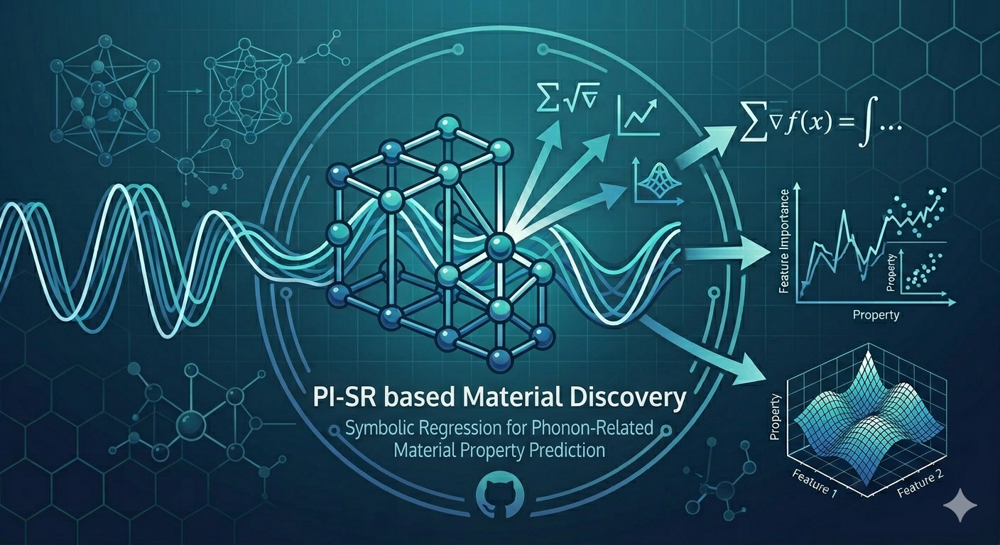

<h1 align="center" style="font-size: 1.7em; font-weight: 600; line-height: 1.3;">
  Physics-Informed Symbolic Regression for<br>
  Phonon-Related Property Prediction and Materials Discovery
</h1>
<p align="center">
  
  
  
  
  
</p>

<p align="center">
  <em>Bridging the gap between data-driven modeling and physical insight.</em><br>
  An XAI framework that derives compact, interpretable analytical scaling relations for phonon-related material properties — enabling targeted materials screening with DFT-level validation.
</p>

<p align="center">
  
</p>

---

## What This Repository Does

Most machine learning models for materials property prediction are black boxes — they interpolate well but cannot explain *why* a material behaves the way it does. This repository takes a different approach.

It implements a fully **explainable AI (XAI)** pipeline that moves from high-dimensional DFT descriptor spaces to compact, physically interpretable symbolic equations of the form:

$$\Theta_D \;=\; f\!\left(G_{VRH},\; E,\; V_{\mathrm{atom}},\; \rho\right)$$

Every step — from feature selection to the final regression formula — is transparent, auditable, and grounded in condensed-matter physics. The framework is demonstrated on **Debye temperature** ($\Theta_D$) and extends naturally to **specific heat** ($C_v$) and **lattice thermal conductivity** ($\kappa$).

---

## Three Pillars of the XAI Framework

### 1 — Dimensionality Reduction and Material Clustering with Physical Transparency
PLS (Partial Least Squares) and PCA (Principal Component Analysis) compress the high-dimensional chemical feature space into low-dimensional **latent representations** that retain physical meaning. PCA reveals how material families (oxides, carbides, metals, …) cluster in descriptor space; PLS identifies which combinations of descriptors carry the most variance in the target property.

### 2 — Symbolic Regression beyond Black-Box Models
[SISSO (Sure Independence Screening and Sparsifying Operator)](https://github.com/renwuli/SISSO) is used to search the space of mathematical expressions and return the **sparsest, most predictive analytical formula**. The result is not a neural network weight matrix — it is a human-readable equation that a physicist can interpret, test, and extend.

### 3 — Critical Regime Analysis (CRA)
Real materials do not behave uniformly across property space. CRA partitions the dataset into LOW / MID / HIGH regimes and computes **dominance scores** (standardised regression coefficients × incremental R²) to identify *which descriptor controls the property in which regime*. This directly answers the question: *"What should I tune to increase $\Theta_D$ in a high-stiffness carbide?"* -- Which is solved by our tunability analysis.

---

## Repository Structure

```
Physics-Informed-Symbolic-Regression.../
│
├── data/                          # Shared raw datasets (Materials Project + AFLOW)
│
├── correlation-matrix-generator/  # Feature screening and Pearson correlation maps
│   └── README.md                  ← configuration and usage
│
├── pls_feature_selection/         # PLS latent-variable feature selection
│   └── README.md                  ← configuration and usage
│
├── sisso_symbolic_regression/     # SISSO descriptor construction and regression
│   └── README.md                  ← configuration and usage
│
├── pca-interpretable-clustering/  # PCA-based chemical class clustering
│   └── README.md                  ← configuration and usage
│
├── critical-regime-analysis/      # CRA dominance and tunability analysis
│   └── README.md                  ← configuration and usage
│
├── assets/
│   └── banner.png                 # Repository header image
│
├── LICENSE
└── README.md                      ← you are here
```

> **Each sub-folder has its own `README.md`** that documents input files, required library versions, step-by-step usage instructions, and a description of every output produced. Start there when working with any individual module.

---

## Pipeline at a Glance

```
Raw DFT Data  (Materials Project + AFLOW)
      |
      v
Correlation Matrix Generator
      |  Pearson screening — remove redundant / collinear features
      v
PLS Feature Selection
      |  Latent-variable regression — rank descriptors by target relevance
      v
SISSO Symbolic Regression
      |  Sparse expression search — output: analytical formula for Θ_D / Cv / κ
      v
Critical Regime Analysis
      |  Regime partitioning — dominance scoring — tunability mapping
      v
PCA Interpretable Clustering
      |  Chemical-class clustering in latent space — visualise family separation
      v
Interpretable Scaling Relations + Materials Design Rules
```

---

## Target Properties

| Property | Symbol | Unit | Source |
|---|---|---|---|
| Debye Temperature | $\Theta_D$ | K | Materials Project, AFLOW |
| Specific Heat (const. volume) | $C_v$ | J/(cell·K) | AFLOW AGL |
| Lattice Thermal Conductivity | $\kappa$ | W/(m·K) | AFLOW AGL |

The symbolic descriptors discovered for $\Theta_D$ are validated against DFT-computed values and assessed for transferability to $C_v$ and $\kappa$, demonstrating that the framework learns physically general latent structure rather than property-specific correlations.

---

## Key Descriptors

| Symbol | Quantity | Unit |
|---|---|---|
| $G_{VRH}$ | Shear Modulus (Voigt–Reuss–Hill) | GPa |
| $E$ | Young's Modulus (Voigt–Reuss–Hill) | GPa |
| $V_{\mathrm{atom}}$ | Volume per Atom | ų/atom |
| $\rho$ | Mass Density | g/cm³ |
| $B_{VRH}$ | Bulk Modulus (Voigt–Reuss–Hill) | GPa |
| $\nu$ | Poisson's Ratio | — |
| $G/B$ | Pugh's Ratio | — |


---

## Getting Started

**1. Clone the repository**
```bash
git clone https://github.com/Shaswat-qm-researcher/Physics-Informed-Symbolic-Regression-for-Phonon-Related-Property-Prediction-and-Materials-Discovery.git
cd Physics-Informed-Symbolic-Regression-for-Phonon-Related-Property-Prediction-and-Materials-Discovery
```

**2. Set up a Python environment**
```bash
conda create -n pisr_env python=3.12 anaconda
conda activate pisr_env
```

**3. Install dependencies for the module you want to run**

Each sub-folder contains its own `requirements.txt` and a `setup_env.py` one-command installer:
```bash
cd critical-regime-analysis      # or any other sub-folder
python setup_env.py
```

**4. Follow the sub-folder README**

Every module is self-contained with its own data inputs, prompts, and outputs. Read the `README.md` inside the relevant sub-folder before running any notebook.

---

## Data Sources

- **Materials Project** — A. Jain *et al.*, APL Materials **1**, 011002 (2013). [https://materialsproject.org](https://materialsproject.org)
- **AFLOW** — S. Curtarolo *et al.*, Computational Materials Science **58**, 218 (2012). [http://aflow.org](http://aflow.org)

---

## License

This project is licensed under the MIT License — see [`LICENSE`](LICENSE) for details.
