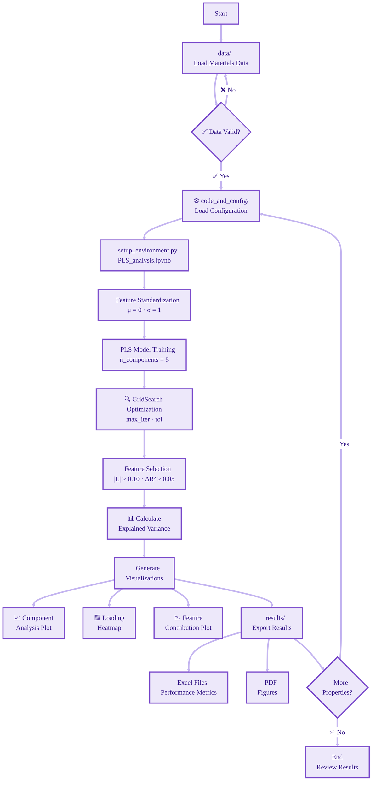

# PLS Regression Based Feature Selection for Thermodynamic and Transport Property Prediction

[](https://www.python.org/downloads/)
[](https://opensource.org/licenses/MIT)

---

## Overview

This repository provides a complete Partial Least Squares Regression (PLS) framework (a Physics-Informed Machine Learning Framework) for identifying the most influential physical descriptors for predicting thermodynamic and transport properties of crystalline materials from latent machine learned space, including:

- **Debye Temperature ($Θ_D$)**: Maximum phonon frequency cutoff
- **Heat Capacity ($C_p$)**: Thermal energy storage at 300K
- **Thermal Conductivity ($\kappa$)**: Phonon-mediated heat transport at 300K
---

> **Note:** This is a sub-repository of the main project:  
> **[Physics-Informed-Symbolic-Regression-for-Phonon-Related-Property-Prediction-and-Materials-Discovery](https://github.com/Shaswat-qm-researcher/Physics-Informed-Symbolic-Regression-for-Phonon-Related-Property-Prediction-and-Materials-Discovery/)**
---

## Project Workflow


---

## Repository Structure

```
plsr_feature_selection/
│
├── data/                             # Input datasets
│   ├── MP_cleaned_dataset.csv        # Materials Project database 
│   ├── AFLOW_cleaned_dataset.csv     # AFLOW database 
│   ├── feature_descriptions.json     # Feature metadata & descriptions
│   └── README.md                     # Data documentation
│
├── code_and_config/                  # Analysis scripts & configuration
│   ├── PLS_analysis.ipynb            # Main Jupyter notebook
│   ├── pls_parameters.json          # Configuration parameters
│   ├── setup_environment.py          # Environment setup script
│   └── README.md                     # Code documentation
│
├── results/                          # Output results
│   ├── excel_data_files/             # Performance metrics & sorted features
│   └── figures/                      # Plots from PLS
|   └── README.md                     # Results documentation
│
├── README.md                         # This file - Main documentation
├── requirements.txt                  # Python dependencies
```

---

## Quick Start

### Setup

```bash
# Install dependencies
pip install -r requirements.txt

# Setup environment (for Jupyter support)
python code_and_config/setup_environment.py

# Run analysis
jupyter notebook code_and_config/PLS_analysis.ipynb
```

---

## Key Features

### 1. Feature Selection Algorithm
- PLSR-based dimensionality reduction
- Automatic loading threshold filtering (|L| > 0.10)
- Incremental R² analysis (ΔR² > 0.05)
- Multicollinearity detection

### 2. Hyperparameter Optimization
- GridSearchCV with 5-fold cross-validation
- Optimizes: `max_iter` [500, 800, 1000, 2000], `tol` [1e-8, 1e-6, 1e-4]
- Scoring: Primary (RMSE), Secondary (R²)

### 3. Multi-Property Support
Can be configured to reduce dimensionality and identify the most important features for any target variable or property, not just the ones demonstrated in this work.

---

## Configuration

### Default Parameters

Configuration file: `code_and_config/pls_parameters.json`

```json
{
  "n_components": 5,
  "loading_threshold": 0.10,
  "incremental_r2_threshold": 0.05,
  "cv_folds": 5,
  "max_iter": [500, 800, 1000, 2000],
  "tol": [1e-8, 1e-6, 1e-4]
}
```

### Adjusting Parameters

| Parameter | Range | Effect |
|-----------|-------|--------|
| `n_components` | 2-20 | Higher = more variance captured, risk overfitting |
| `loading_threshold` | 0.05-0.30 | Higher = fewer and more important features |
| `incremental_r2_threshold` | 0.01-0.15 | Higher = fewer components retained |

---

## Documentation

- **[data/README.md](data/README.md)**: Dataset descriptions, feature definitions
- **[code_and_config/README.md](code_and_config/README.md)**: Code usage, configuration
- **[results/README.md](results/README.md)**: Results structure, output files

---

## Citation

If you use this code in your research, please cite:

```bibtex
@article{
}
```

---

## Authors

- **Shaswat Pathak**, **Vardhman Dwivedi**, **Albert Linda**, and **Somnath Bhowmick**  
---

## Contact & Support

For questions, issues, or collaboration:
- **Email**: shaswatpathak.qm.researcher@gmail.com and bsomnath@iitk.ac.in 
- **Institution**: Indian Institute of Technology Kanpur, Kanpur, Uttar Pradesh, 208016, India
---

## License

MIT License - See LICENSE file for details

---

## Acknowledgments

- **[Materials Project]((https://materialsproject.org))** for DFPT-computed materials database
- **[AFLOW Consortium](https://aflow.org)** for high-throughput materials data
- **[scikit-learn](https://scikit-learn.org/stable/modules/generated/sklearn.cross_decomposition.PLSRegression.html)** team for PLS implementation

**Last Updated**: 08-04-2026
