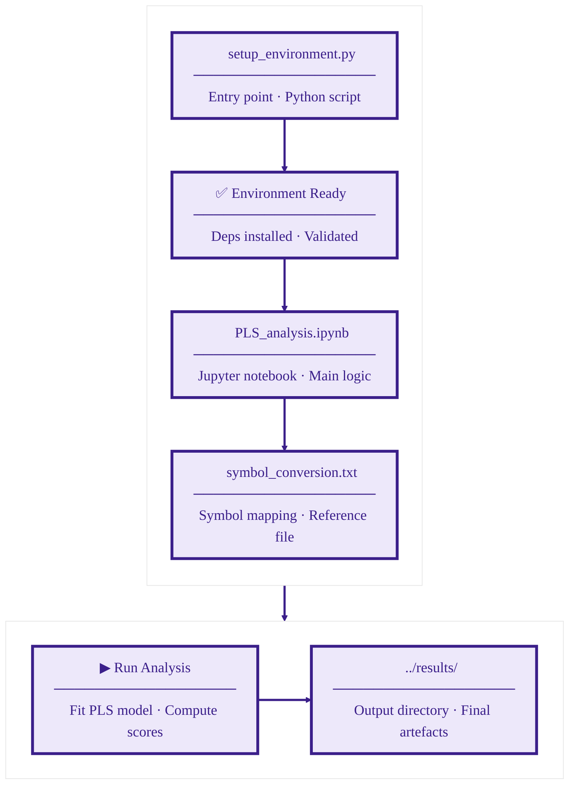

# Code and Configuration

This folder contains all analysis scripts, configuration files, and environment setup tools for the PLS feature selection framework.

---

## Contents

### 1. PLS_analysis.ipynb

Main analysis notebook for complete PLS feature selection workflow.

**Workflow Steps:**

1. Data Loading: Load CSV/Excel files from `../data/`
2. Configuration: Set PLS parameters interactively
3. Feature Standardization: Apply StandardScaler (μ=0, σ=1)
4. PLS Training: Fit model with GridSearchCV optimization
5. Feature Selection: Identify top features based on loadings
6. Visualization: Generate 3 plots
7. Export: Save results to `../results/`

**Usage:**

```bash
# Standard Jupyter
jupyter notebook PLS_analysis.ipynb

# JupyterLab
jupyter lab PLS_analysis.ipynb

# VS Code
# Open in VS Code and select kernel
```

**Interactive Prompts:**

- File path: Location of input CSV/Excel file
- Input columns: Features for PLS (comma-separated)
- Output column: Target property (Θ_D, C_p, κ)
- LaTeX text file: File `symbol_conversion.txt` containing information about excel coloums headers, scientific notations. 
- Parameters: `n_components`, `loading_threshold`, `incremental_r2_threshold`
- Save path: Output directory for results

---

### 2. pls_parameters.json

Configuration file containing all default parameters and property-specific configurations.

**Key Sections:**

1. Default Parameters
2. Property-Specific Configs
3. Feature Symbols Mapping (LaTeX)

---

### 3. setup_environment.py

Universal environment setup script that automatically configures Python environment for Jupyter notebook execution across all platforms.

**Supported Platforms:**

- Google Colab
- Jupyter Notebook/Lab
- Anaconda Navigator
- Visual Studio Code
- PyCharm
- Command Line/Terminal

**Features:**

- Auto-detects current environment
- Installs required packages
- Sets up Jupyter kernels
- Provides platform-specific instructions

**Usage:**

```bash
python setup_environment.py
```

**Setup Options:**

1. Create Conda environment (recommended for Anaconda users)
2. Create Virtual environment (venv)
3. Install in current environment
4. Show VS Code instructions

**Example Output:**

```bash
Choose setup option:
  1. Create Conda environment
  2. Create Virtual environment (venv)
  3. Install in current environment
  4. Show VS Code setup instructions
  5. Exit

Enter choice (1-5): 1

Creating conda environment 'pls_env'...
✓ Success

Installing packages...
✓ numpy==2.0.1
✓ pandas==2.2.3
...
✓ All packages installed!

To activate:
  conda activate pls_env
  jupyter notebook
```

---

## Configuration Guide

### PLS Parameters

| Parameter | Default | Range | Effect |
|-----------|---------|-------|--------|
| `n_components` | 5 | 2-20 | Number of PLS components to extract |
| `loading_threshold` | 0.10 | 0.05-0.30 | Min \|L\| for feature retention |
| `incremental_r2_threshold` | 0.05 | 0.01-0.15 | Min ΔR² for component significance |

### GridSearch Parameters

| Parameter | Values | Description |
|-----------|--------|-------------|
| `max_iter` | [500, 800, 1000, 2000] | NIPALS algorithm iterations |
| `tol` | [1e-8, 1e-6, 1e-4] | Convergence tolerance |
| `cv_folds` | 5 | Cross-validation folds |

---

## Workflow Integration



---

## Required Packages

```txt
numpy==2.0.1
pandas==2.2.3
scipy==1.14.1
scikit-learn==1.5.2
matplotlib==3.9.2
openpyxl==3.1.2
statsmodels==0.14.1
jupyter
jupyterlab
ipykernel
```

---

## Troubleshooting

### Issue: Jupyter kernel not found

**Solution:**
```bash
python -m ipykernel install --user --name pls_env
```

### Issue: Import errors in notebook

**Solution:**
```bash
# Restart kernel after installing packages
# Kernel → Restart
```

### Issue: VS Code cannot find environment

**Solution:**
1. Open Command Palette (Ctrl+Shift+P)
2. Select "Python: Select Interpreter"
3. Choose the pls_env interpreter

---
